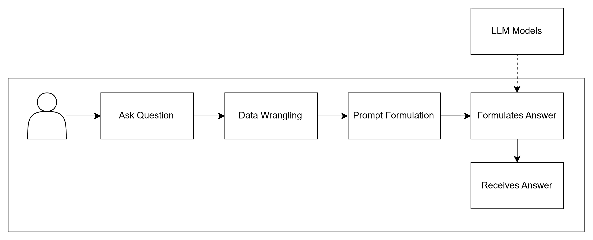
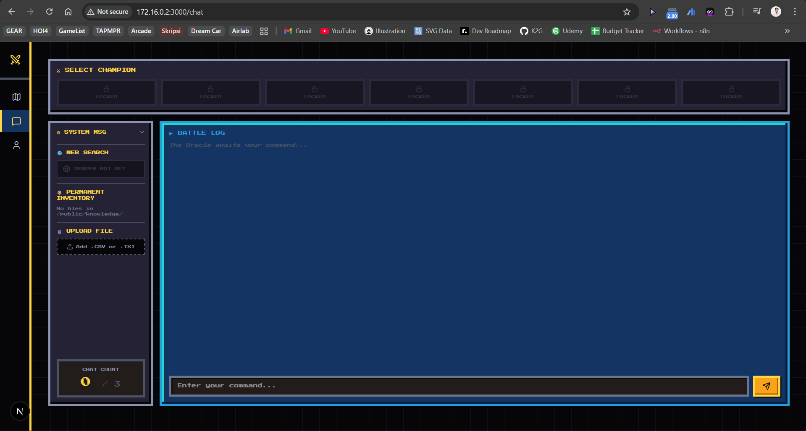
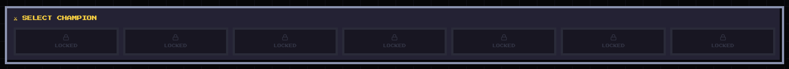
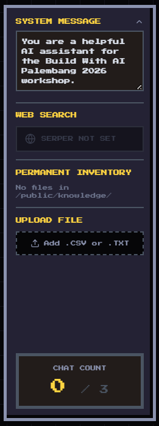

# Module 1: Inference Pipeline — Chat Completion Interface

> **Tujuan Modul:** Menghubungkan frontend aplikasi ke LLM API menggunakan API Route Next.js, sehingga kamu bisa melakukan chat nyata dengan model Gemini atau Groq dari dashboard yang sudah disediakan.

> **Estimasi Waktu:** 15–30 menit

---

## Apa yang Akan Kamu Pelajari

- Cara kerja **API Route** di Next.js (App Router)
- Cara membuat request ke **Google Gemini API** dan **Groq API**
- Konsep **System Prompt** — instruksi yang membentuk persona dan perilaku AI
- Cara mengelola **chat history / memori** dalam konteks LLM

---

## Gambaran Alur Kerja

```
[User mengetik pesan]
       ↓
[Frontend (chat/page.tsx)]
       ↓  POST /api/chat
[API Route (src/app/api/chat/route.ts)]
       ↓  HTTP Request + API Key
[Gemini / Groq / Ollama API]
       ↓  Response teks
[Ditampilkan di Battle Log]
```

> *Diagram arsitektur — lihat gambar di bawah:*



---

---

## Instalasi Environment Website

### Clone Repository

```bash
git clone [COMING SOON!]
cd workshop-bwai-palembang-2026
```

### Install Dependencies

```bash
npm install
```

Proses ini akan mengunduh semua package yang dibutuhkan. Butuh beberapa menit tergantung koneksi internet.

### Setup File Environment

Buat file `.env.local` di root project:
```bash
# Windows (Command Prompt)
copy .env.local.example .env.local

# macOS / Linux
cp .env.local.example .env.local
```

Kemudian buka file `.env.local` dan isi dengan API key yang sudah kamu dapatkan:
```env
GEMINI_API_KEY=AIza...
GROQ_API_KEY=gsk_...
SERPER_API_KEY=...
```

> Untuk saat ini, cukup isi `GEMINI_API_KEY` dulu. Key lainnya bisa ditambahkan nanti sesuai modul.

### Jalankan Development Server

```bash
npm run dev
```

Buka browser dan akses: **http://localhost:3000**

Kamu seharusnya melihat **AI Quest Dashboard** dengan tampilan 8-bit. Selamat, environment kamu sudah siap!

---

## Verifikasi Modul 0

Checklist sebelum lanjut ke Module 1:

- [ ] Node.js v18+ terinstall (`node --version`)
- [ ] npm terinstall (`npm --version`)
- [ ] Repository sudah di-clone
- [ ] `npm install` berhasil dijalankan
- [ ] File `.env.local` sudah dibuat dan minimal `GEMINI_API_KEY` sudah diisi
- [ ] `npm run dev` berhasil dan website terbuka di `localhost:3000`

---

> **Selanjutnya:** [Module 1 — Inference Pipeline: Chat Completion Interface](../Module%201/Module%201%20-%20Quickstart.md)

---

## Tambahkan API Keys ke Environment

Pastikan file `.env.local` di root project sudah berisi minimal satu API key:

```env
# Wajib untuk menggunakan Gemini
GEMINI_API_KEY=AIza...

# Opsional — untuk mengaktifkan model Groq
GROQ_API_KEY=gsk_...

# Opsional — untuk fitur web search (Module 3)
SERPER_API_KEY=...
```

> Cara mendapatkan key ada di [Module 0](../Module%200/Module%200%20-%20Environment.md).

Setelah mengisi `.env.local`, **restart** development server agar environment variable terbaca:

```bash
# Tekan Ctrl+C untuk stop, lalu jalankan lagi:
npm run dev
```

---

## Memahami Struktur API Route

File utama yang menangani semua permintaan chat ada di:

```
src/app/api/chat/route.ts
```

File ini berfungsi sebagai **backend serverless** yang:
1. Menerima permintaan dari frontend (`POST /api/chat`)
2. Membaca API key dari environment variables (aman, tidak terekspos ke browser)
3. Meneruskan pesan ke API LLM yang sesuai (Gemini / Groq / Ollama)
4. Mengembalikan respons ke frontend

**Payload yang dikirim frontend ke API Route:**
```json
{
  "model": "gemini",
  "messages": [
    { "role": "user", "content": "Halo, siapa kamu?" }
  ],
  "systemMessage": "Kamu adalah asisten AI untuk workshop Build with AI Palembang 2026.",
  "knowledgeBase": ""
}
```

---

## Build dan Jalankan Website

Jika belum dijalankan, start development server:

```bash
npm run dev
```

Buka **http://localhost:3000** di browser, lalu navigasi ke halaman **CHATBOT** menggunakan sidebar kiri.



---

## Memahami Antarmuka Chatbot

### SELECT CHAMPION (Pilih Model)

Di bagian atas halaman chatbot, kamu akan melihat panel **SELECT CHAMPION** yang menampilkan daftar model yang tersedia.

| Model | Provider | Status |
|-------|----------|--------|
| Gemini | Google AI | Aktif jika `GEMINI_API_KEY` diisi |
| GPT-OSS 120B | Groq | Aktif jika `GROQ_API_KEY` diisi |
| GPT-OSS 20B | Groq | Aktif jika `GROQ_API_KEY` diisi |
| Llama 4 Scout | Groq | Aktif jika `GROQ_API_KEY` diisi |
| Llama 3.3 70B | Groq | Aktif jika `GROQ_API_KEY` diisi |
| Llama 3.1 8B | Groq | Aktif jika `GROQ_API_KEY` diisi |
| Ollama | Local | Aktif jika Ollama berjalan di `localhost:11434` |

Model yang **terkunci (LOCKED)** akan berwarna gelap dan tidak bisa diklik — kamu perlu mengisi API key yang sesuai di `.env.local` terlebih dahulu.



### BATTLE LOG (Riwayat Chat)

Area tengah adalah ruang percakapan. Pesan dari kamu tampil di **kanan** (warna kuning), respons dari AI tampil di **kiri**.

### Fitur Memory (Konteks Chat)

Aplikasi ini menyimpan **maksimal 5 giliran terakhir** (5 pasang pesan user+AI = 10 pesan) sebagai konteks yang dikirim ke API. Ini memungkinkan AI mengingat percakapan sebelumnya dalam satu sesi.

> Refresh halaman akan **mereset** riwayat chat — ini adalah batasan sesi browser.

---

## Kustomisasi System Prompt

Di panel kiri chatbot, klik **"SYSTEM MSG"** untuk membuka editor system prompt.

System prompt adalah instruksi yang diberikan ke AI **sebelum percakapan dimulai** — ini yang menentukan "kepribadian" dan batasan AI kamu.

**Default system prompt:**
```
You are a helpful AI assistant for the Build With AI Palembang 2026 workshop.
```

**Contoh kustomisasi:**
```
Kamu adalah asisten AI bernama "Palbot" yang ahli dalam teknologi kecerdasan buatan. 
Jawab semua pertanyaan dalam Bahasa Indonesia dengan gaya yang ramah dan edukatif. 
Jika ada pertanyaan di luar topik AI, arahkan kembali ke topik utama.
```

> Mengubah system prompt akan menyelesaikan **Side Quest: "Customize the System Prompt"** di Mission Dashboard!



---

## Complete The Quest — Chat dengan LLM kamu!

Untuk menyelesaikan **Main Quest: "Start Me Up"**, kamu perlu:

1. Pilih model yang aktif (tidak LOCKED)
2. Ketik pesan di kolom input bawah
3. Kirim pesan **3 kali** — tekan Enter atau klik tombol kirim
4. Lihat AI merespons di Battle Log

Setelah 3 pesan terkirim dan AI merespons, kamu akan mendapat notifikasi achievement **"Chat Novice — 3 messages sent!"** dan quest akan otomatis tercentang di Mission Dashboard.

> *Video demo chat pertama — COMING SOON!*
> [](COMING_SOON)

---

## Troubleshooting

| Masalah | Penyebab | Solusi |
|---------|----------|--------|
| Semua model LOCKED | API key belum diisi | Isi `.env.local` dan restart server |
| Error "API key not set" | Key salah atau kosong | Periksa kembali isi `.env.local` |
| Error "quota exceeded" | Batas gratis tercapai | Coba model lain atau tunggu reset |
| Ollama tidak aktif | Service tidak berjalan | Jalankan `ollama run llama3.2` |
| Tidak ada respons AI | Koneksi internet putus | Cek koneksi internet |

---

## Verifikasi Modul 1

Checklist sebelum lanjut ke Module 2:

- [ ] Minimal satu model aktif (tidak LOCKED) di chatbot
- [ ] Bisa mengirim pesan dan mendapat respons dari AI
- [ ] Sudah kirim 3 pesan (quest "Start Me Up" selesai)
- [ ] Sudah mencoba mengubah system prompt

---

> **Kembali ke:** [Module 0 — Environment](../Module%200/Module%200%20-%20Environment.md)
> **Selanjutnya:** [Module 2 — Knowledge Augmentation](../Module%202/Module%202%20-%20Knowledge%20Augmentation.md)