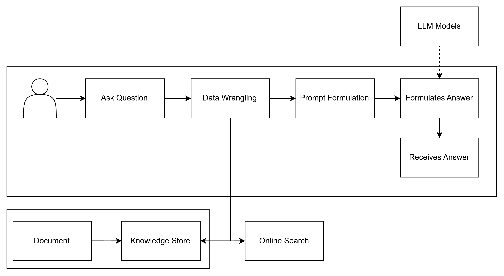
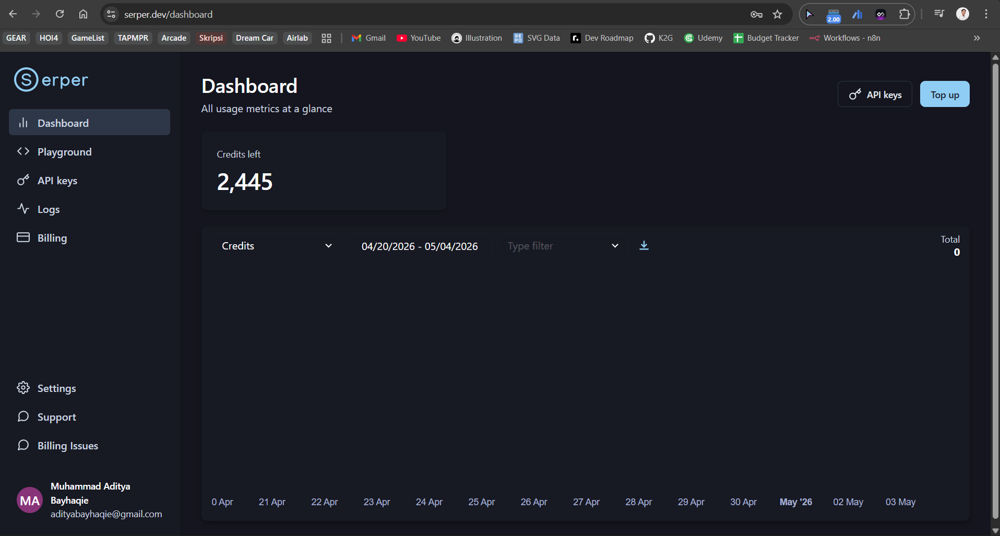

# Module 3: Agentic Workflows — Dynamic Search via Tool Calling

> **Tujuan Modul:** Memberikan kemampuan kepada LLM untuk **mencari informasi terbaru dari internet** menggunakan Serper API, sehingga AI tidak lagi terbatas pada data training atau knowledge base statis.

> **Estimasi Waktu:** 15–30 menit

---

## Apa yang Akan Kamu Pelajari

- Konsep **Agentic AI** — AI yang bisa mengambil tindakan, bukan hanya menjawab
- Apa itu **Tool Calling / Function Calling**
- Cara kerja **Serper API** sebagai alat pencarian web untuk LLM
- Perbedaan antara LLM "statik" (hanya tahu dari training) vs LLM "agentic" (bisa cari info baru)

---

## Apa itu Agentic AI?

AI konvensional hanya **menjawab** berdasarkan data yang ada di memori training-nya. Masalahnya, data training punya batas waktu — AI tidak tahu tentang berita terkini, harga saham hari ini, atau kejadian yang baru saja terjadi.

**Agentic AI** adalah AI yang bisa **bertindak** — salah satunya dengan memanggil tool eksternal seperti mesin pencari web.

**Alur kerja Tool Calling:**
```
[User tanya: "Berita AI terbaru hari ini?"]
         ↓
[LLM mengenali perlu info terkini]
         ↓
[LLM memanggil tool "search" dengan query tertentu]
         ↓
[Serper API mencari di Google dan mengembalikan hasil]
         ↓
[LLM membaca hasil pencarian]
         ↓
[LLM memberikan jawaban berdasarkan hasil pencarian terkini]
```

> *Diagram Tool Calling — lihat gambar di bawah:*



---

## Mendapatkan Serper API Key

Serper.dev adalah layanan yang menyediakan akses ke hasil pencarian Google melalui API — dengan format yang mudah dibaca oleh program.

**Langkah-langkah:**

1. Buka [https://serper.dev](https://serper.dev)
2. Klik **"Get Started"** dan daftar akun gratis
3. Akun gratis mendapat **2.500 pencarian gratis per bulan** — cukup untuk workshop
4. Di dashboard, salin **API Key** kamu



---

## Menambahkan Serper API Key ke Project

Buka file `.env.local` dan tambahkan:

```env
SERPER_API_KEY=your_serper_api_key_here
```

Kemudian **restart development server**:
```bash
# Tekan Ctrl+C untuk stop, lalu:
npm run dev
```

Setelah restart, di Mission Dashboard kamu akan melihat quest **"Connect to Serper"** berubah menjadi (completed).

---

## Memahami Implementasi Tool Calling

Di aplikasi ini, tool calling diimplementasikan di:

```
src/app/api/chat/route.ts
```

Saat `SERPER_API_KEY` tersedia dan model mendukung function calling, LLM dapat:

1. **Mendeteksi** bahwa pertanyaan user membutuhkan informasi terkini
2. **Memanggil** Serper API dengan query pencarian yang relevan
3. **Menerima** hasil pencarian dalam format JSON
4. **Merangkum** hasil pencarian menjadi jawaban yang natural

**Contoh pemanggilan Serper API:**
```json
{
  "q": "berita teknologi AI terbaru 2026",
  "gl": "id",
  "hl": "id",
  "num": 5
}
```

**Contoh respons Serper:**
```json
{
  "organic": [
    {
      "title": "Google Merilis Gemini 3 Flash Preview",
      "link": "https://...",
      "snippet": "Google mengumumkan model terbaru..."
    }
  ]
}
```

---

## Cara Menggunakan Web Intelligence di Chatbot

Setelah `SERPER_API_KEY` diisi dan server direstart:

1. Buka halaman **CHATBOT**
2. Pilih model yang mendukung tool calling (Gemini atau model Groq)
3. Coba tanyakan sesuatu yang membutuhkan informasi terkini:

**Contoh pertanyaan yang memicu web search:**
```
Apa berita AI terbaru hari ini?
Berapa harga USD ke IDR sekarang?
Apa yang terjadi di Indonesia minggu ini?
```

**Pertanyaan yang TIDAK memerlukan web search:**
```
Apa itu machine learning?
Jelaskan cara kerja neural network.
Bantu saya debug kode Python ini.
```

> *Video demo web search — COMING SOON!*
> [](COMING_SOON)

---

## Perbedaan RAG vs Web Search

| Aspek | RAG (Module 2) | Web Search (Module 3) |
|-------|---------------|----------------------|
| **Sumber data** | File lokal (CSV/TXT) | Internet (Google via Serper) |
| **Keaktualan** | Statis — sesuai isi file | Dinamis — real-time |
| **Kontrol konten** | Penuh — kamu yang tentukan | Terbatas — tergantung hasil Google |
| **Kecepatan** | Sangat cepat | Lebih lambat (butuh HTTP call) |
| **Penggunaan terbaik** | Data internal, dokumen spesifik | Info terkini, berita, harga |

---

## Complete The Quest — Welcome to the Grid!

Untuk menyelesaikan **Main Quest: "Welcome to the Grid"**, kamu perlu:

1. Isi `SERPER_API_KEY` di `.env.local`
2. Restart development server
3. Verifikasi quest "Connect to Serper" selesai di Mission Dashboard

> Quest ini selesai secara otomatis saat server berhasil membaca `SERPER_API_KEY` — kamu tidak perlu melakukan web search secara manual.

---

## Troubleshooting

| Masalah | Penyebab | Solusi |
|---------|----------|--------|
| Quest "Connect to Serper" tidak selesai | Key belum diisi atau server belum restart | Isi `.env.local` dan restart `npm run dev` |
| AI tidak melakukan web search | Model tidak mendukung atau prompt tidak trigger | Coba tanyakan hal yang jelas butuh info terkini |
| Error "Serper API limit exceeded" | Kuota gratis habis | Tunggu reset bulanan atau upgrade ke paid |
| Hasil pencarian tidak relevan | Query terlalu umum | Buat pertanyaan yang lebih spesifik |

---

## Verifikasi Modul 3

Checklist sebelum lanjut ke Module 4:

- [ ] `SERPER_API_KEY` sudah diisi di `.env.local`
- [ ] Server sudah direstart setelah menambahkan key
- [ ] Quest "Connect to Serper" / "Welcome to the Grid" selesai di Mission Dashboard
- [ ] (Bonus) Sudah mencoba bertanya sesuatu yang memerlukan informasi terkini

---

> **Kembali ke:** [Module 2 — Knowledge Augmentation](../Module%202/Module%202%20-%20Knowledge%20Augmentation.md)
> **Selanjutnya:** [Module 4 — Production & Deployment](../Module%204/Module%204%20-%20Production.md)
