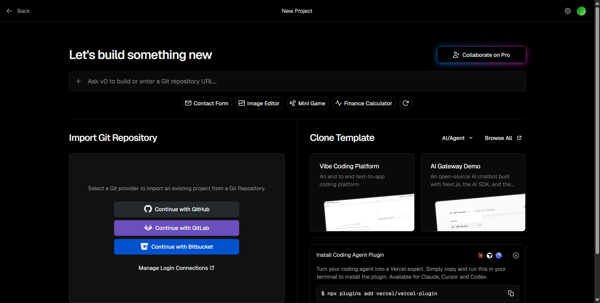
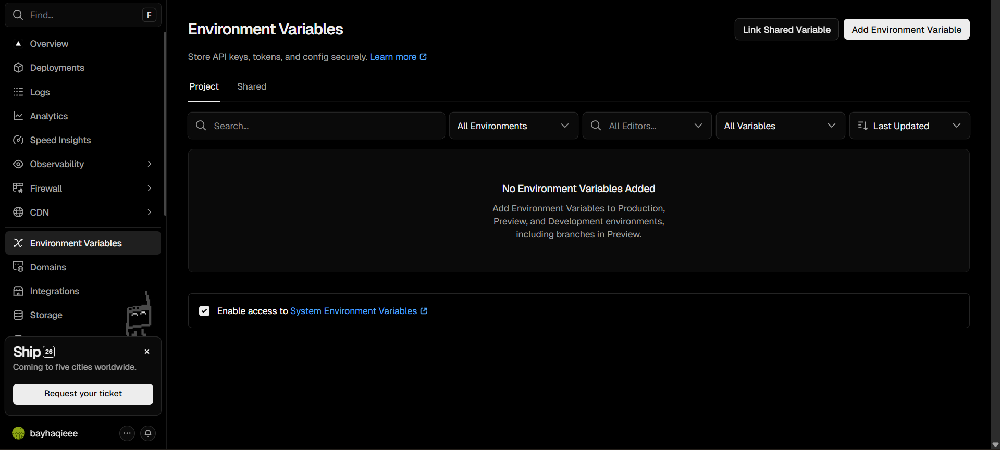

# Module 4: Deployment & Edge Scaling

> **Tujuan Modul:** Men-deploy aplikasi AI Quest Dashboard dari `localhost` ke URL publik menggunakan **Vercel**, sehingga bisa diakses oleh siapa saja dari manapun — tanpa perlu server sendiri.

> **Estimasi Waktu:** 10–20 menit

---

## Apa yang Akan Kamu Pelajari

- Cara kerja **deployment** aplikasi Next.js ke cloud
- Apa itu **Vercel** dan mengapa ideal untuk Next.js
- Cara mengonfigurasi **Environment Variables** di production (agar API key tetap aman)
- Konsep **Edge Runtime** dan mengapa penting untuk performa
- Hal-hal yang perlu diperhatikan saat transisi dari `localhost` ke production

---

## Mengapa Vercel?

**Vercel** adalah platform deployment yang dibuat oleh tim yang sama yang membangun Next.js. Ini menjadikannya pilihan terbaik untuk deploy aplikasi Next.js karena:

| Fitur | Keterangan |
|-------|------------|
| **Zero-Config Deploy** | Vercel mendeteksi Next.js otomatis tanpa konfigurasi tambahan |
| **Serverless Functions** | API Routes Next.js otomatis jadi serverless function |
| **Edge Network** | Konten di-cache dan di-serve dari server terdekat dengan user |
| **Free Tier** | Gratis untuk proyek personal dan hobby |
| **Otomatis SSL** | HTTPS otomatis tersedia tanpa setup manual |
| **Preview Deployments** | Setiap branch dapat URL preview tersendiri |

---

## Persiapan Sebelum Deploy

### 1. Pastikan Repository Ada di GitHub

Vercel bekerja dengan cara **menghubungkan ke GitHub repository** — setiap kali kamu push ke GitHub, Vercel otomatis re-deploy.

Jika belum punya repository GitHub untuk project ini:

```bash
# Inisialisasi git (jika belum)
git init

# Tambahkan semua file
git add .

# Commit pertama
git commit -m "feat: initial AI Quest Dashboard"

# Buat repository baru di GitHub (lewat website github.com)
# Lalu hubungkan:
git remote add origin https://github.com/username/nama-repo.git
git push -u origin main
```

> **Penting:** Pastikan `.env.local` ada di `.gitignore` — **JANGAN** pernah commit file ini ke GitHub karena berisi API key rahasia!

Verifikasi `.gitignore` sudah memuat:
```
.env.local
.env*.local
```

### 2. Buat Akun Vercel

1. Buka [https://vercel.com](https://vercel.com)
2. Klik **"Sign Up"**
3. Pilih **"Continue with GitHub"** — ini cara termudah
4. Otorisasi akses Vercel ke akun GitHub kamu

---

## Deploy ke Vercel

### Cara 1: Melalui Dashboard Vercel (Direkomendasikan)

1. Login ke [https://vercel.com/dashboard](https://vercel.com/dashboard)
2. Klik **"Add New Project"**
3. Di bagian **"Import Git Repository"**, pilih repository workshop kamu
4. Vercel akan otomatis mendeteksi bahwa ini adalah proyek Next.js



5. **Sebelum klik Deploy**, tambahkan Environment Variables (langkah selanjutnya)

### Cara 2: Menggunakan Vercel CLI

```bash
# Install Vercel CLI
npm install -g vercel

# Login ke akun Vercel
vercel login

# Deploy dari folder project
vercel
```

---

## Konfigurasi Environment Variables di Production

Ini adalah langkah **paling penting** — tanpa ini, API key tidak akan terbaca dan aplikasi tidak akan berfungsi di production.

> **Ingat:** Di production, kita **tidak** menggunakan file `.env.local`. Kita memasukkan nilai environment variables langsung ke dashboard Vercel.

### Cara Menambahkan di Dashboard Vercel

1. Di halaman konfigurasi project (sebelum deploy pertama), scroll ke bagian **"Environment Variables"**
2. Tambahkan setiap key berikut:

| Key | Value | Environment |
|-----|-------|-------------|
| `GEMINI_API_KEY` | `AIza...` | Production, Preview, Development |
| `GROQ_API_KEY` | `gsk_...` | Production, Preview, Development |
| `SERPER_API_KEY` | `...` | Production, Preview, Development |

3. Klik **"Deploy"**



### Cara Menambahkan Setelah Deploy (Update Key)

1. Masuk ke dashboard project kamu di Vercel
2. Pergi ke **Settings → Environment Variables**
3. Tambah atau edit variable yang diinginkan
4. Klik **"Save"**
5. **Redeploy** project untuk perubahan berlaku: pergi ke **Deployments → klik "..." → Redeploy**

---

## Memahami Keamanan API Key di Production

Saat aplikasi berjalan di Vercel, ada pemisahan penting yang perlu kamu pahami:

```
Browser (Client-side)              Vercel Server (Server-side)
         │                                    │
         │  ← HTML, CSS, JS →                │
         │                                    │  ← Environment Variables
         │  POST /api/chat →                  │     (GEMINI_API_KEY, dll)
         │                                    │
         │  ← { reply: "..." } ←             │
         │                                    │
[User tidak bisa lihat API key]    [API key aman di sini]
```

**Poin penting:**
- API key **HANYA ada di server** — tidak pernah dikirim ke browser
- User hanya menerima **hasil respons** dari LLM, bukan API key-nya
- Ini adalah arsitektur yang benar dan aman untuk production

---

## Verifikasi Deployment

Setelah deploy selesai, Vercel akan memberikan URL publik seperti:
```
https://workshop-bwai-palembang-2026.vercel.app
```

Lakukan pengecekan berikut di URL publik tersebut:

- [ ] Halaman utama (Mission Dashboard) tampil dengan benar
- [ ] Model yang aktif (sesuai API key yang diisi) muncul di chatbot
- [ ] Bisa mengirim pesan dan mendapat respons dari LLM
- [ ] Permanent Inventory menampilkan file dari `public/knowledge/`

> *Screenshot aplikasi yang sudah live — COMING SOON!*
> 

---

## Custom Domain (Opsional)

Jika kamu ingin menggunakan domain sendiri (misalnya `bwai-palembang.com`):

1. Di dashboard Vercel, pergi ke **Settings → Domains**
2. Klik **"Add"** dan masukkan domain kamu
3. Ikuti instruksi untuk update DNS record di registrar domain kamu
4. Vercel akan otomatis generate sertifikat SSL (HTTPS)

---

## Tips Production Readiness

### 1. Rate Limiting
API Gemini dan Groq memiliki batas request per menit/hari. Pastikan ada handling error yang baik saat quota tercapai (sudah diimplementasikan di aplikasi).

### 2. Monitoring
Gunakan **Vercel Analytics** (tersedia di dashboard) untuk memantau jumlah request dan performa.

### 3. Environment Separation
Gunakan API key yang berbeda untuk `Development` dan `Production` agar mudah memantau penggunaan masing-masing.

### 4. Branch Deployments
Setiap branch GitHub yang di-push akan mendapat **URL preview** tersendiri dari Vercel — sangat berguna untuk testing fitur baru sebelum merge ke main.

---

## Troubleshooting

| Masalah | Penyebab | Solusi |
|---------|----------|--------|
| Build gagal di Vercel | Error TypeScript atau dependency | Jalankan `npm run build` lokal dulu untuk cek error |
| API tidak berfungsi di production | Environment variable tidak diset | Periksa Settings → Environment Variables di Vercel |
| Model semua LOCKED di production | Key salah atau belum disimpan | Re-check key dan redeploy |
| Halaman tidak update | Cache Vercel | Pergi ke Deployments → Redeploy |
| Permanent Inventory kosong | File tidak ada di `public/knowledge/` | Pastikan file sudah di-commit ke GitHub |

---

## Verifikasi Modul 4

Checklist final:

- [ ] Repository project ada di GitHub
- [ ] `.env.local` tidak ikut ter-commit (ada di `.gitignore`)
- [ ] Project berhasil di-import ke Vercel
- [ ] Environment Variables sudah diset di Vercel dashboard
- [ ] Deploy berhasil dan mendapat URL publik
- [ ] Aplikasi berfungsi normal di URL publik (chat, model selector, KB)

---

## Selamat! Kamu Telah Menyelesaikan Workshop!

Kamu sudah berhasil membangun dan men-deploy **AI Quest Dashboard** — sebuah aplikasi web AI full-stack yang nyata, dari nol hingga bisa diakses secara publik.

**Apa yang sudah kamu pelajari:**
- Cara setup environment dan mendapatkan API key untuk layanan AI
- Cara membangun backend API Route di Next.js untuk memanggil LLM
- Implementasi RAG menggunakan file knowledge base
- Integrasi web search via Serper API
- Deploy aplikasi Next.js ke Vercel dengan environment variable yang aman

**Langkah selanjutnya yang bisa kamu eksplorasi:**
- 🔹 Implementasi streaming response untuk UX yang lebih responsif
- 🔹 Menambahkan autentikasi user
- 🔹 Menyimpan riwayat chat ke database
- 🔹 Implementasi vector database untuk RAG yang lebih canggih
- 🔹 Menambahkan lebih banyak tools untuk agentic AI

---

> **Kembali ke:** [Module 3 — Web Intelligence](../Module%203/Module%203%20-%20Web%20Intelligence.md)
> **Kembali ke:** [README Utama](../../README.md)
